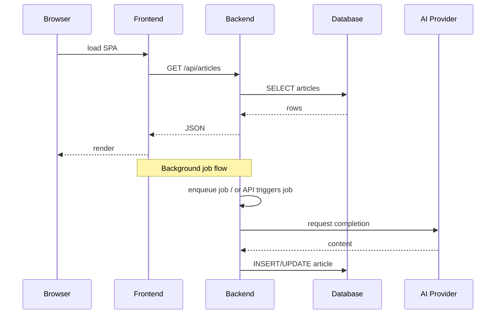

# Assimetria-Test — Architecture

This document describes the high-level architecture for the Assimetria demo app, covering the frontend, backend, data flows, background jobs, and deployment recommendations.

## Purpose

Provide a concise reference for developers and operators describing how the pieces of the system interact, where responsibilities live, and how to run the system locally or in production.

## Components

- `frontend/` — React app (Vite) that renders the UI and calls backend APIs. Key files: `src/main.jsx`, `src/pages/ArticlePage.jsx`, `src/api/client.js`.
- `backend/` — Node.js service providing article APIs, background jobs and a Prisma-managed database. Key files: `src/index.js`, `src/routes/articleRoutes.js`, `src/services/*`, `prisma/schema.prisma`.
- `infra/` — orchestration and deployment helpers (e.g. `docker-compose.yml`, CI `buildspec.yml`, env templates).
- Database — PostgreSQL / compatible relational DB used by Prisma (connection configured via `DATABASE_URL`). A generated Prisma client can be found under `backend/generated/prisma/client`.

## High-level data flow

1. User opens the SPA in a browser. The browser loads assets served by the dev server or static host.
2. The SPA calls the backend REST API (base URL controlled by `VITE_API_BASE`) to list, view, or request article processing.
3. The backend handles requests, queries/updates the database via Prisma, and returns JSON responses.
4. Background jobs (run locally or in a worker process) process article generation or enrichment by calling external AI APIs and then persisting results back to the DB.

Mermaid sequence (renderers that support mermaid can visualize this):



## Background jobs

- Jobs are implemented in `src/jobs/` and orchestrated by `src/services/articleJob.js` (or similar). Jobs may be run:
	- in-process (same service) as scheduled tasks
	- as separate worker processes/containers for isolation and scaling
- Jobs call `src/services/aiClient.js` to communicate with external AI providers, then persist results via Prisma.

## API surface (summary)

- REST endpoints under `/api` (see `src/routes/articleRoutes.js`) for listing, retrieving and creating/updating articles.
- The frontend's `src/api/client.js` encapsulates how the SPA calls the backend — update this when backend routes change.

## Persistence & schema migrations

- Schema lives at `prisma/schema.prisma` and migrations are under `prisma/migrations`.
- Local migration workflow:

```bash
cd backend
npx prisma migrate dev --schema=prisma/schema.prisma
```

- Generate Prisma client when schema changes:

```bash
npx prisma generate --schema=prisma/schema.prisma
```

## Deployment & operations

- Local development: run `npm run dev` for frontend and backend individually, or use `docker-compose up --build` from the repo root to run services together.
- Production recommendations:
	- Serve the frontend as static assets from a CDN or static object store behind a CDN.
	- Run the backend as one or more stateless containerized services behind a load balancer.
	- Use a managed relational DB (RDS, Cloud SQL, etc.) and inject `DATABASE_URL` via a secrets manager.
	- Run background jobs as separate scalable worker deployments or scheduled serverless functions depending on workload.
	- Expose metrics and logs to a centralized observability stack (Prometheus + Grafana, or hosted provider).

## Scaling considerations

- Backend: horizontal scale is straightforward — keep services stateless and use a shared DB + message queue if job throughput grows.
- Jobs: if AI calls are rate-limited, implement concurrency limits and retry/backoff.
- Database: scale vertically or use read replicas for heavy read traffic. Add indices for query patterns discovered in production.

## Security

- Keep API keys out of source control — use `.env` locally and a secrets manager in production.
- The frontend only receives `VITE_`-prefixed env variables; never embed secret keys in client-side code.
- Use HTTPS in production and validate/escape any user-generated content saved or rendered by the app.

## Observability and backups

- Logs: write structured logs to stdout so container platforms or the host can collect them.
- Metrics: instrument request counts, latencies, job success/failure rates, and AI API error rates.
- Backups: schedule regular DB backups for the production database and periodically verify restore procedures.

## Local developer workflow

1. Copy `.env.example` to `.env` in each service and fill values (`backend/.env`, `frontend/.env`).
2. Start the DB (locally or via Docker) and run migrations.
3. Run services:

```bash
# backend
cd backend
npm install
npm run dev

# frontend
cd frontend
npm install
npm run dev
```

Or

```bash
docker-compose up --build
```